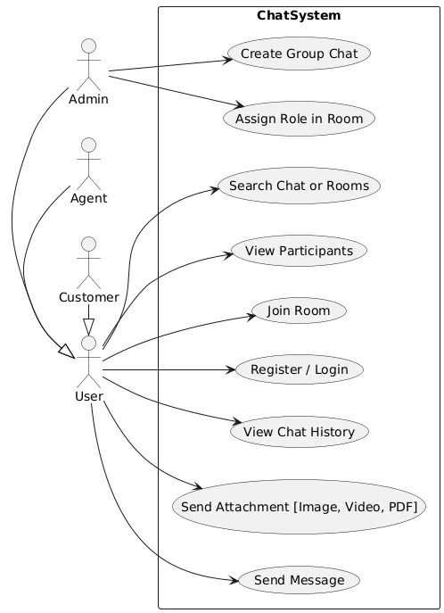
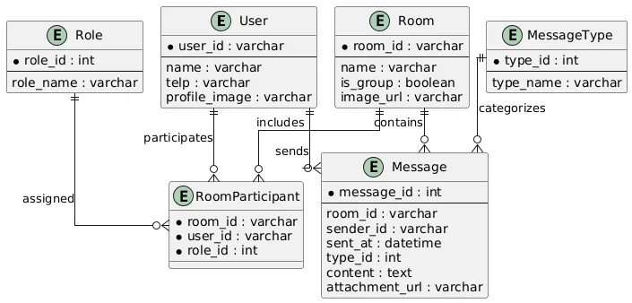
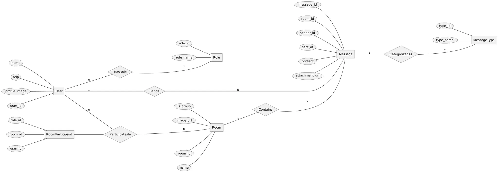
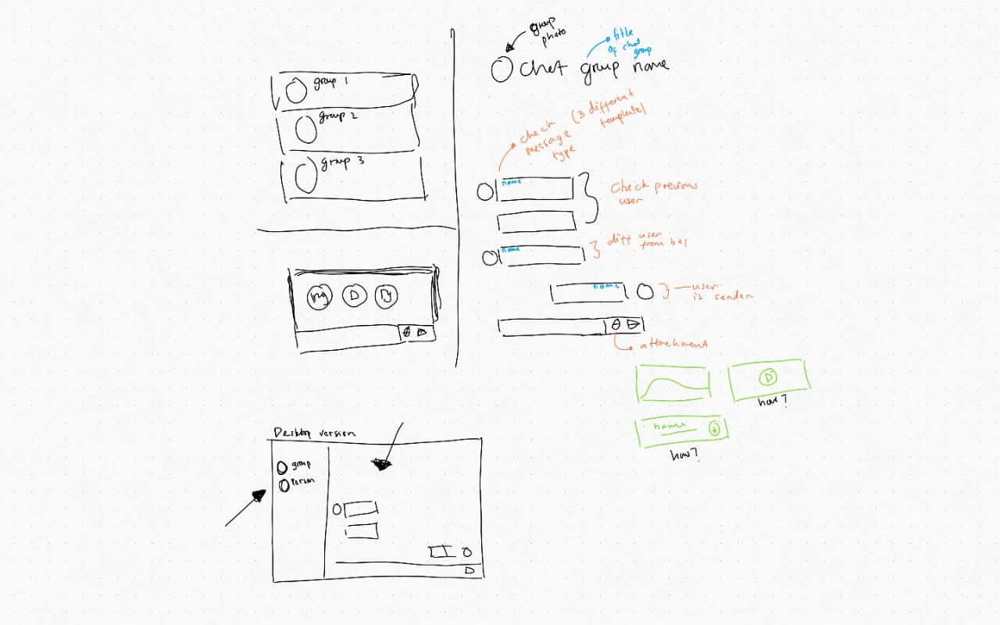

# 💬 Simple Chat System

## 📊 Diagrams

### ✅ Use Case Diagram


### 🗃️ Entity Relationship Diagram (ERD)


### 🔗 Chen ERD Diagram


### 🏔️ UI States


> 📁 All diagrams are stored in the `diagrams/` folder.

---

## 🚀 Deployment

🔗 **Live Demo:** [https://chat-app.aryaprasetya.me](https://chat-app.aryaprasetya.me)

---

## 🛠️ Getting Started

To run this project locally:
**Clone the repository**
   ```bash
   git clone https://github.com/aryapras22/simple-chat-app.git
   cd simple-chat-app
   npm install
   npm run dev
   server run on : http://localhost:3000
   ```
